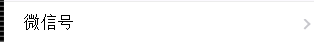
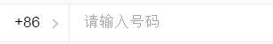
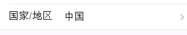
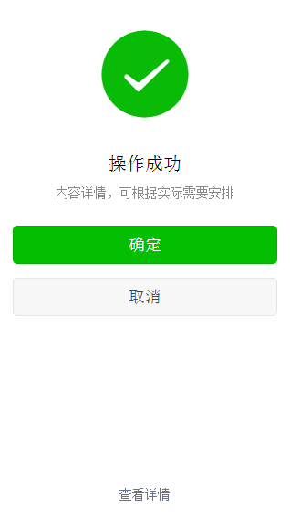

# vue-weui组件列表

## 目录

<!-- toc -->
* [1. 按钮相关](#1-按钮相关)
    * [ButtonArea](#buttonarea)
    * [Button](#button)
* [2. 列表（Cells）相关](#2-列表cells相关)
    * [CellsTitle](#cellstitle)
    * [CellsTips](#cellstips)
    * [Cells](#cells)
    * [Cell](#cell)
    * [RadioCell](#radiocell)
    * [CheckboxCell](#checkboxcell)
    * [SwitchCell](#switchcell)
    * [InputCell](#inputcell)
    * [SelectCell](#selectcell)
    * [Toptips](#toptips)
* [3. 提示框（Toast）相关](#3-提示框toast相关)
    * [Toast](#toast)
* [4. 对话框相关](#4-对话框相关)
    * [Dialog](#dialog)
* [5. 进度条相关](#5-进度条相关)
    * [Progress](#progress)
* [6. 消息页相关](#6-消息页相关)
    * [Message](#message)
* [7. 文章相关](#7-文章相关)
    * [Article](#article)
* [8. 操作菜单相关](#8-操作菜单相关)
    * [Actionsheet](#actionsheet)
* [9. 图标相关](#9-图标相关)
    * [Icon](#icon)
* [10. 网格相关](#10-网格相关)
    * [Grids](#grids)
    * [Grid](#grid)

<!-- toc stop -->


## 组件列表

### 1. 按钮相关

#### ButtonArea

按钮放置的区域

#### Button

按钮

* props：

```javascript
/**
 * 按钮颜色类型
 * primary: 主色
 * warn：警告色
 * default：默认色（灰色）
 */
type: {
  type: String,
  default: 'primary',
  required: false
},

/**
 * 是否为disabled按钮，若为true则会阻止点击事件
 */
disabled: {
  type: Boolean,
  default: false,
  required: false
},

/**
 * 是否为小按钮
 */
mini: {
  type: Boolean,
  default: false,
  required: false
},

/**
 * 是否为plain按钮，plain按钮无填充色，只有边框
 * 目前只有primary和default类型支持plain按钮
 */
plain: {
  type: Boolean,
  default: false,
  required: false
}
```

### 2. 列表（Cells）相关

列表种类较多，vue-weui做了非常细致的拆分，通过不同组合可以构造丰富的内容。

一些常用结构如下：

```html
<cells-title>标题</cells-title>

<!-- 普通列表项 -->
<cells>
  <cell>
    <span slot="header">列表头</span>
    <span slot="body">主内容区</span>
    <span slot="footer">说明文字</span>
  </cell>
  ...
</cells>

<!-- 其它种类的列表项 -->
<cells type="radio">
  <radio-cell></radio-cell>
  ...
</cells>

<cells type="checkbox">
  <checkbox-cell></checkbox-cell>
  ...
</cells>

<cells type="form">
  <switch-cell></switch-cell>
  ...
</cells>

<cells type="form">
  <input-cell></input-cell>
  ...
</cells>

<cells type="split">
  <select-cell></select-cell>
  ...
</cells>

<cells-tips>底部说明</cells-tips>
```

#### CellsTitle

Cells标题

#### CellsTips

Cells底部说明文字

#### Cells

可包含多个Cell的容器，Cell需要包含于其中

* props

```javascript
/**
 * Cells类型
 * access: 带跳转的列表项容器
 * form: 表单容器
 * radio: 单选列表项容器
 * checkbox: 多选列表项容器
 */
type: {
  type: String,
  default: '',
  required: false
}
```

#### Cell

一个列表项

* props

```javascript
/**
 * 跳转链接，若设置，则此列表项会变为链接
 */
link: {
  type: String,
  required: false
},

/**
 * vue-router使用的跳转链接
 * 若使用vue-router，推荐使用router-link而非link
 */
routerLink: {
  type: null,
  required: false
}
```

* slots

    * `<slot name="header">`: 列表项头部
    * `<slot name="body">`: 列表项主内容区
    * `<slot name="footer">`: 列表项尾部

* 补充说明

Cell一般用于普通的文本、图标或链接列表项，若为表单列表项，需使用对应的RadioCell，CheckboxCell，SwitchCell，InputCell或SelectCell

#### RadioCell

单选列表项，其中包含`<input type="radio">`

* props

```javascript
/**
 * radio input的id
 */
id: {
  type: String,
  required: false
},

/**
 * radio input的name
 */
name: {
  type: String,
  required: false
},

/**
 * radio input的value
 */
value: {
  type: String,
  required: false
},

/**
 * 显示的文本内容
 */
label: {
  type: String,
  required: true
},

/**
 * 选中项的数据绑定，用于radio input的v-model
 */
picked: {
  type: String,
  required: true,
  twoWay: true
}
```

#### CheckboxCell

单选列表项，其中包含`<input type="checkbox">`

* props

```javascript
/**
 * checkbox input的id
 */
id: {
  type: String,
  required: false
},

/**
 * checkbox input的name
 */
name: {
  type: String,
  required: false
},

/**
 * checkbox input的value
 */
value: {
  type: String,
  required: false
},

/**
 * 显示的文本内容
 */
label: {
  type: String,
  required: true
},

/**
 * 选中项的数据绑定，用于checkbox input的v-model
 */
checked: {
  type: null,
  required: true,
  twoWay: true
}
```

* 补充

单个Checkbox的数据绑定为逻辑值，多个则为数组，具体可参见[表单控件绑定 - vue.js](http://cn.vuejs.org/guide/forms.html#Checkbox)

#### SwitchCell

开关列表项，其中包含`<input type="checkbox">`

* props

```javascript
/**
 * checkbox input的id
 */
id: {
  type: String,
  required: false
},

/**
 * checkbox input的name
 */
name: {
  type: String,
  required: false
},

/**
 * checkbox input的value
 */
value: {
  type: String,
  required: false
},

/**
 * 显示的文本内容
 */
label: {
  type: String,
  required: true
},

/**
 * 开关本质上是checkbox，所以此项代表选中项
 * 用于checkbox input的v-model
 */
on: {
  type: null,
  required: true,
  twoWay: true
}
```

* 补充

单个Checkbox的数据绑定为逻辑值，多个则为数组，具体可参见[表单控件绑定 - vue.js](http://cn.vuejs.org/guide/forms.html#Checkbox)

#### InputCell

文本输入框列表项，包含一个`<input type="text">`或`<textarea>`

* props

```javascript
/**
 * 输入框的类型
 * text: 单行输入框（默认）
 * textarea：文本域
 */
type: {
  type: String,
  required: false,
  default: 'text'
},

/**
 * 输入框的id
 */
id: {
  type: String,
  required: false
},

/**
 * 输入框的name
 */
name: {
  type: String,
  required: false
},

/**
 * 输入框的placeholder
 */
placeholder: {
  type: String,
  required: false
},

/**
 * 输入框的标签，会显示在最前方
 */
label: {
  type: String,
  required: false
},

/**
 * 输入框的数据绑定，会作为input或textarea的v-model
 */
value: {
  type: String,
  required: true,
  twoWay: true
},

/**
 * 验证码的url，若设置则验证码会显示在最后
 */
vcode: {
  type: String,
  required: false
},

/**
 * 是否为表单报错的列表项
 * 若为true则文字会标红，且会显示红色感叹号
 */
warn: {
  type: Boolean,
  required: false,
  default: false
},

/**
 * type为textarea时的行数
 */
rows: {
  type: Number,
  default: 3,
},

/**
 * 支持的最大输入长度
 * 若type为textarea且设定了maxlength，则会出现字数统计标签
 */
maxlength: {
  type: Number,
  required: false
}
```

#### SelectCell

选择框列表项，会包含一个`<select>`

```javascript
/**
 * 选项数组
 */
options: {
  type: Array,
  required: true
},

/**
 * 选中项数据绑定，会用于select的v-model
 */
selected: {
  type: null,
  required: true,
  twoWay: true
},

/**
 * 是否为前置选择框，具体请参见下方示例
 */
before: {
  type: Boolean,
  required: false,
  default: false
},

/**
 * 是否为后置选择框，具体请参见下方示例
 */
after: {
  type: Boolean,
  required: false,
  default: false
}
```

* __普通选择框__



如图，普通选择框会占据整个宽度，其代码为

```html
<select-cell
  :options="['微信号', 'QQ号', 'Email']"
  :selected.sync="selected">
</select-cell>
```

* __前置选择框__



前置选择框的`select`被存放于`header`中，因此还需通过`slot`为其指定`body`

```html
<select-cell
  :before="true"
  :options="['+86', '+80', '+84', '+87']"
  :selected.sync="selected">
  <cell-input
    slot="body"
    type="text"
    placeholder="请输入号码"
    :value.sync="phoneValue">
  </cell-input>
</select-cell>
```

* __后置选择框__



后置选择框可以包含`header`，同样通过`slot`进行指定

```html
<select-cell
  :after="true"
  :options="['中国', '美国', '英国']"
  :selected.sync="selected">
  <span slot="header">国家/地区</span>
</select-cell>
```

关于`slot`的更多说明请参见[组件 - vue.js](http://cn.vuejs.org/guide/components.html#使用_Slot_分发内容)

#### Toptips

顶部错误提示

### 3. 提示框（Toast）相关

#### Toast

* props

```javascript
/**
 * toast类型
 * icon: 包含图标的提示框（默认）
 * loading: 包含loading动画的提示框
 */
type: {
  type: String,
  required: false,
  default: 'icon'
}
```

* 补充

可以通过`v-show`来控制Toast是否显示

```html
<toast v-show="true">显示的Toast</toast>
<toast v-show="false">不显示的Toast</toast>
<toast v-show="toastControll">根据toastControll的值来判断</toast>
```

### 4. 对话框相关

#### Dialog

* props

```javascript
/**
 * 对话框类型
 * alert: 提示框，只包含确定按钮（默认）
 * confirm: 询问框，包含确定和取消按钮
 */
type: {
  type: String,
  required: false,
  default: 'alert'
},

/**
 * 对话框标题
 */
title: {
  type: String,
  required: true
},

/**
 * 确定按钮名称
 */
confirmButton: {
  type: String,
  required: false,
  default: '确定'
},

/**
 * 取消按钮名称
 */
cancelButton: {
  type: String,
  required: false,
  default: '取消'
}
```

* events

    * __`weui-dialog-confirm`__: 确定按钮点击事件

    * __`weui-dialog-cancel`__: 取消按钮点击事件

* 示例

```html
<template>
<dialog v-show="dialogControl" type="confirm" title="标题"
  @weui-dialog-confirm="handleDialogAction('确定')"
  @weui-dialog-cancel="handleDialogAction('取消')">
  <p>自定义弹窗内容</p>
  <p>hahahaha，快点确定</p>
</dialog>
</template>

<script>
import {Dialog} from 'vue-weui';

export default {
  data() {
    return {
      dialogControl: true
    };
  },

  methods: {
    handleDialogAction(action) {
      alert(`你刚刚点击了“${action}”`);
      this.dialogControl = false;
    }
  },

  components: {
    Dialog
  }
}
</script>
```

### 5. 进度条相关

#### Progress

* props

```javascript
/**
 * 进度，最小为0，最大为100
 */
progress: {
  type: Number,
  required: true,
  validator(value) {
    return value >= 0 && value <= 100;
  },
  default: 0
},

/**
 * 是否包含取消按钮，若有，则点击时会出发weui-progress-cancel事件
 */
hasCancelButton: {
  type: Boolean,
  required: false,
  default: true
}
```

* events

    * __`weui-progress-cancel`__: 取消按钮点击事件

### 6. 消息页相关

#### Message

一个完整的消息页



* props

```javascript
/**
 * 消息图标名称
 * 若设置，则会在最上方显示大图标
 */
icon: {
  type: String,
  required: false
},

/**
 * 消息标题
 */
title: {
  type: String,
  required: false
}
```

* slots

    * `<slot name="content">`: 消息内容详情区
    * `<slot name="operation">`: 消息操作区，一般为按钮组
    * `<slot name="extra">`: 消息底部区
    
### 7. 文章相关

#### Article

文章容器

### 8. 操作菜单相关

#### Actionsheet

底部上拉菜单

* props

```javascript
/**
 * 双向绑定的数据，用于控制是否显示Actionsheet
 */
show: {
  type: Boolean,
  required: true,
  twoWay: true
},

/**
 * 菜单键值对
 */
menus: {
  type: Object,
  required: false,
  default: {}
},

/**
 * 操作项键值对
 */
actions: {
  type: Object,
  required: false,
  default: {}
}
```

* events

    * __`weui-menu-click(key)`__: 菜单项点击事件，`key`为点击菜单项的键值
    * __`weui-menu-click(key)`__: 操作项点击事件，`key`为点击操作项的键值

* 补充

    1. 操作项在点击后会默认关闭Actionsheet，而菜单项不会
    2. 菜单项和操作项传递时，除了纯文本也可以传递`HTML`字符串

### 9. 图标相关

#### Icon

* props

```javascript
/**
 * 图标名称，可能的取值有
 * success, success_circle, success_no_circle,
 * info, waiting, waiting_circle, circle,
 * warn, download, info_circle, cancel
 */
name: {
  type: String,
  required: true
},

/**
 * 图标类型
 * default: 默认小图标（默认）
 * message: 用于消息页的大图标
 * safe: 轮廓为盾牌的大图标
 */
type: {
  type: String,
  required: false,
  default: 'default'
}
```

### 10. 网格相关

常用的网格结构如下（一行三格）：

```html
<grids>
  <!-- 一个格子 -->
  <grid link="some-link" label="some-text" imageUrl="url-of-icon"></grid>
  <!-- 另一个格子 -->
  <grid link="some-link" label="some-text" imageUrl="url-of-icon"></grid>
  <!-- 第三个格子 -->
  <grid link="some-link" label="some-text" imageUrl="url-of-icon"></grid>
  <!-- 因为一行三格，所以第四个格子会显示在第二行 -->
  <grid link="some-link" label="some-text" imageUrl="url-of-icon"></grid>
  <!-- 更多的格子…… -->
</grids>
```

#### Grids

网格容器，内部包含Grid

#### Grid

一个格子

* props

```javascript
/**
 * 跳转链接，会添加在标签的href属性中
 */
link: {
  type: String,
  required: false
},

/**
 * vue-router使用的跳转链接
 * 若使用vue-router，推荐使用router-link而非link
 * 会添加在v-link属性中
 */
routerLink: {
  type: null,
  required: false
},

/**
 * 图标地址
 */
imageUrl: {
  type: String,
  required: false
},

/**
 * 标签，显示在图标下方
 */
label: {
  type: null,
  required: false
}
```
